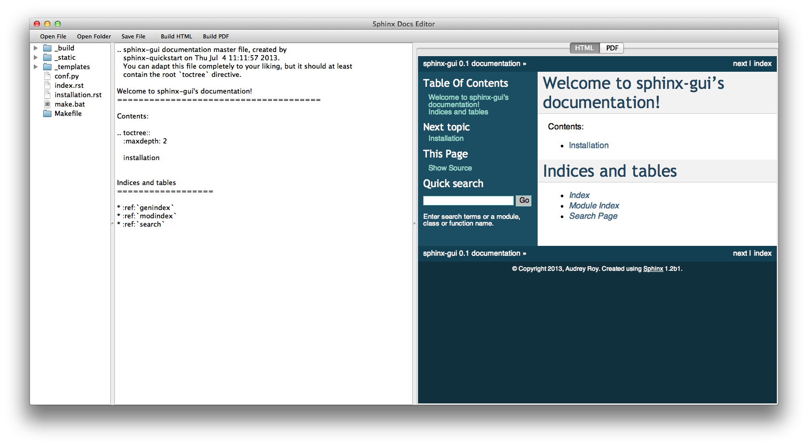

============
sphinx-gui
============

A desktop GUI for viewing and editing Sphinx docs in ReStructuredText.  Made with PySide (http://www.pyside.org).

Documentation
-------------

http://sphinx-gui.rtfd.org

This is pre-alpha
-----------------

Still a work in progress. Contributions are welcome!
